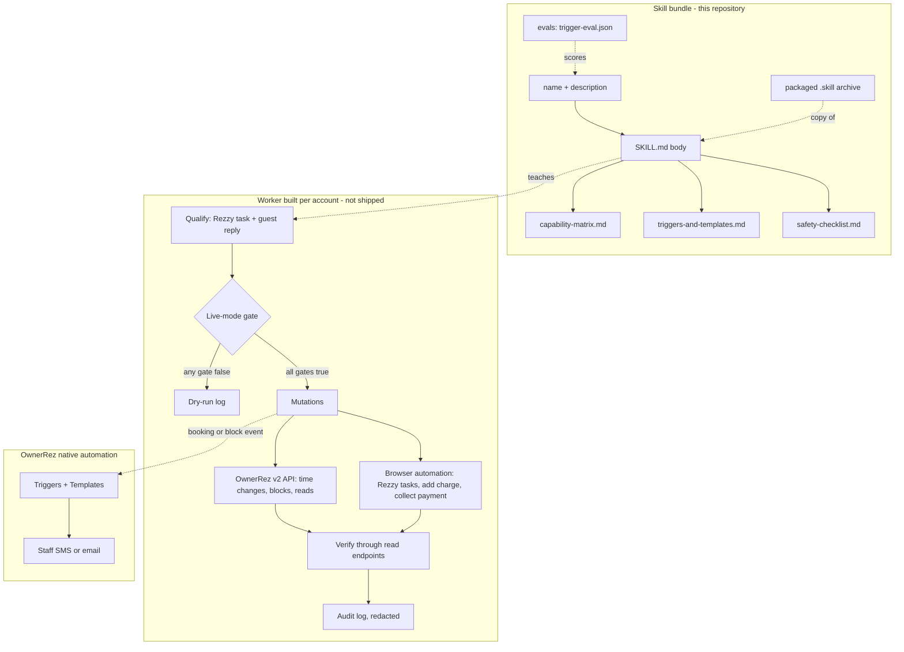

# System architecture

## Overview

The repository is a Claude Code skill: Markdown knowledge plus an evaluation set, with no executable code. Two architectures are worth keeping apart.

### 1. The skill bundle (what this repository contains)

| part | role |
|---|---|
| `ownerrez-upsell-automation/SKILL.md` frontmatter | `name` and `description`, the only text Claude sees when deciding whether to load the skill |
| `SKILL.md` body | four non-negotiables, the API-vs-UI summary, the investigate-first rule, the safety architecture, and pointers to the references |
| `references/capability-matrix.md` | full API-vs-UI breakdown, UI quirks, OTA handling, rate-limit handling |
| `references/triggers-and-templates.md` | the Triggers + Templates playbook and its three save gotchas |
| `references/safety-checklist.md` | ordered canary-rollout checklist |
| `ownerrez-upsell-automation.skill` | the same folder packaged as a zip archive for single-file install; its contents matched the source folder when compared on 2026-09-18 |
| `evals/` | trigger-description eval set (`trigger-eval.json`) and its methodology (`evals/README.md`) |
| `BRAIN.md`, `brain/` | this project brain, added 2026-09-18 |

Loading is progressive: the body stays short and tells Claude to read each reference when the situation calls for it, not up front.

### 2. The worker the skill prescribes (built per account, not shipped here)

In whatever language the builder picks, the skill describes these parts: a qualification step over Rezzy tasks and guest replies; a live-mode gate; an OwnerRez v2 API client for everything the API supports; browser automation for the three UI-only operations; an idempotent state machine that proves each step through read endpoints; and a redacted audit log. Staff alerts are deliberately **not** part of the worker: OwnerRez's own Triggers fire on the booking and block events that the worker's mutations produce.

## Module graph

## Constraints

- **No code, stack-agnostic.** Everything is prose and patterns; nothing ties a worker to a language or framework. The repository has no tests, build or CI (checked 2026-09-18).
- **Two copies of the skill.** The folder and the `.skill` archive have to be kept in step by hand; no script in the repository builds the archive (inferred from the absence of one).
- **Account-neutral content.** The skill must never carry a real fee, contact or property detail. It teaches where those come from instead.
- **Platform drift.** The UI facts describe OwnerRez as observed when written. The skill tells Claude to treat them as a strong prior and verify against the live account before building.
- **The description is load-bearing.** Any change to `name` or `description` should be re-scored with the eval set; see [[trigger-description-evals]].
