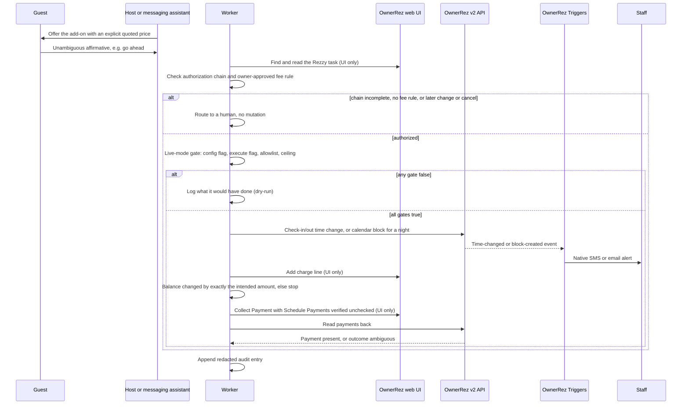

# Key flows

## End-to-end path of a typical request

The typical operation is one guest-approved upsell, for example a late check-out, taken through the worker the skill prescribes. Steps marked "UI only" have no documented API and run through browser automation. The skill does not fix the order between the booking change and the charge; the order below is illustrative. Whatever the order, a failure after an earlier step succeeded is preserved and flagged for a human, never rolled back automatically.

An ambiguous payment outcome is reconciled against the payments-read endpoint and then goes to a human before any resubmission; see [[ownerrez-state-is-source-of-truth]].

## Other important flows

### Skill triggering

Claude sees only the skill's `name` and `description`, decides whether the request is in scope, then loads `SKILL.md`, and reads a reference file only when the situation calls for it. The eval set checks the first step; see [[trigger-description-evals]].

### Configuring a staff-alert Trigger safely

1. Choose the event the worker's mutation naturally produces (time changed, or blocked-off time created), not a generic event plus filtering.
2. Set the Event first and let the Action list reload.
3. Set the Action/Template last, through the visible widget, right before saving.
4. Save, then load the record's edit URL fresh and re-read the Action.
5. Check the list page's running total moved by exactly the number of records intended.

Details: [[native-triggers-for-staff-alerts]].

### Canary rollout (from `references/safety-checklist.md`)

1. Every live fee confirmed in writing by the business owner for each property/service pair.
2. Add Charge and Collect Payment form labels confirmed on the live account without saving or submitting.
3. Every staff contact confirmed against a canonical source; name collisions flagged.
4. Allowlist of exactly one booking; charge ceiling just above the one expected amount.
5. Card on file confirmed in the Cards On File section, not payment history.
6. One live run, verified in OwnerRez itself: one charge line, one payment, correct booking state, the alert actually sent.
7. Any ambiguous outcome reconciled through the payments-read endpoint before a second attempt.
8. Widen deliberately in separate steps: one booking, then a property, then the account.

Gate design: [[live-mode-requires-stacked-gates]].
