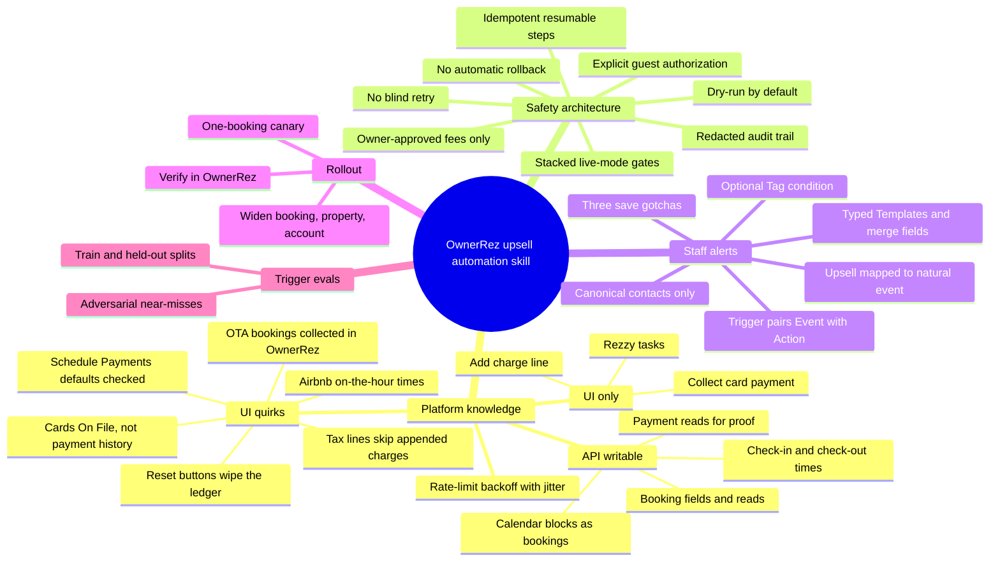

# Feature mindmap

## Feature mindmap

The skill's knowledge branches, as organised across `SKILL.md`, its three reference files and `evals/`.

Pages behind the branches: [[api-first-browser-only-for-gaps]], [[live-mode-requires-stacked-gates]], [[charge-authorization-chain]], [[ownerrez-state-is-source-of-truth]], [[native-triggers-for-staff-alerts]], [[trigger-description-evals]].
