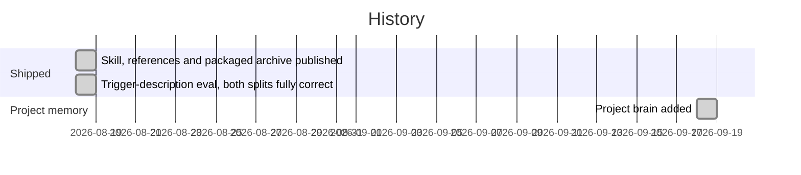

# Roadmap

## Milestones

Dated history from `git log`. The repository records no forward plan, so there are no future milestones below; candidates are listed as open questions instead.

## Open questions (not commitments)

None of these is planned in the repository; each needs an owner decision before it becomes a milestone.

- **Re-verification cadence.** Should the UI facts be re-checked against a live OwnerRez account on a schedule, given the skill itself warns that OwnerRez changes its UI?
- **Body-level evals.** Add tests that a worker built with the skill keeps dry-run as the default, refuses to invent a fee, and never blind-retries a payment.
- **Archive sync.** Automate building the `.skill` archive, or add a check that it matches the folder.
- **Eval upkeep.** Re-score and extend the near-miss set whenever the description changes or an adjacent skill appears; see [[trigger-description-evals]].
