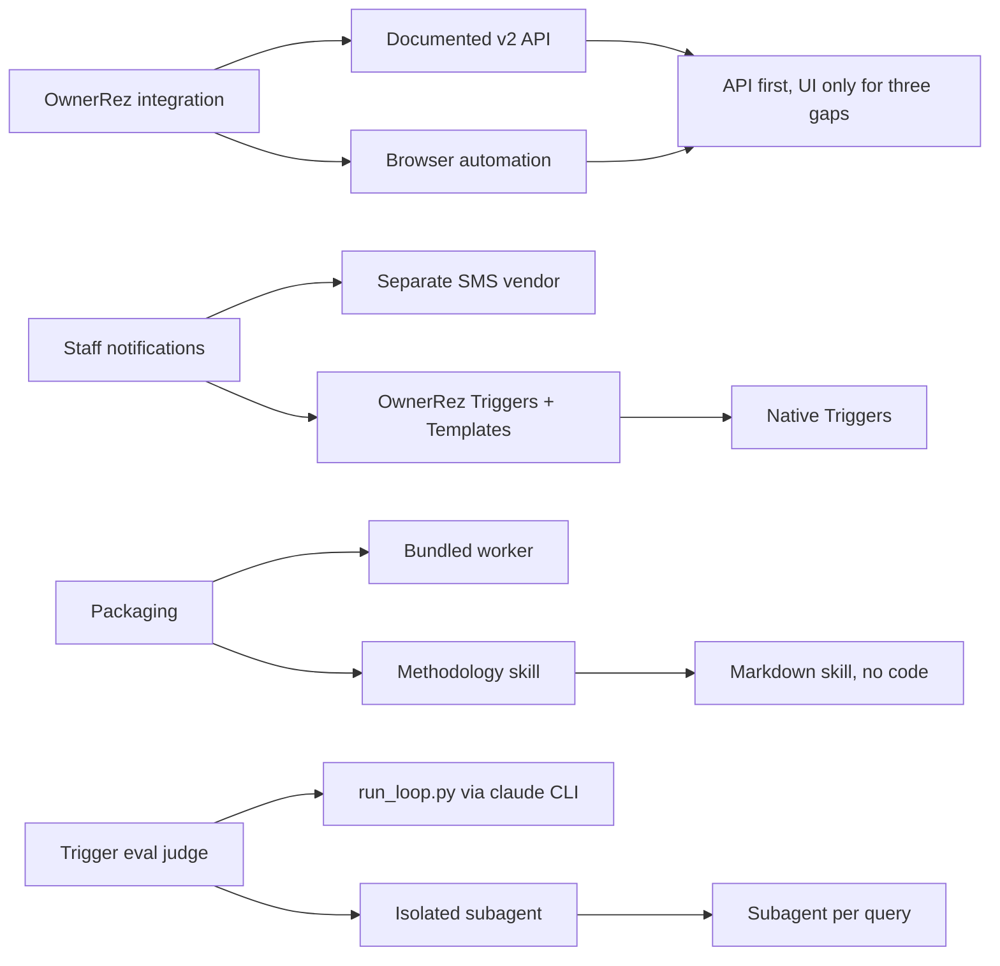

# Tech stack

## Technology choices

| domain | candidates | decision | rationale |
|---|---|---|---|
| Packaging | Claude Code skill; bundled application or library | Claude Code skill: `SKILL.md` with frontmatter plus a `references/` folder | The knowledge has to reach Claude while it builds a worker; progressive disclosure keeps the body short |
| Content | Markdown with runnable code; Markdown only | Markdown only | The worker is built per account in the user's own stack; the repository ships no code |
| Distribution | Clone and copy the folder; packaged archive | Both: copy the folder into a personal or project skills directory, plus a committed `.skill` zip archive | README install path; the archive's purpose (single-file install) is inferred |
| Worker language | Any | Not chosen; left to the builder | The safety pattern is stated as stack-agnostic |
| OwnerRez integration | Documented v2 REST API; browser automation | API wherever documented; browser only for the three UI-only operations | UI fallback adds fragility; see [[api-first-browser-only-for-gaps]] |
| Staff notifications | SMS vendor integrated into the worker; OwnerRez Triggers + Templates | Native Triggers + Templates | No extra vendor to build or maintain; see [[native-triggers-for-staff-alerts]] |
| Rate limiting | React to 429 responses; limit pre-emptively | Pre-emptive sliding-window limiter, plus exponential backoff with jitter on a 429 | OwnerRez documents no `Retry-After` header; the published limit is in `capability-matrix.md` |
| Trigger evaluation | skill-creator `run_loop.py`; a context-isolated subagent per query | Isolated subagent per query | `run_loop.py` needs a standalone `claude` CLI that the authoring environment lacked; see [[trigger-description-evals]] |
| Licence | (none recorded) | MIT | `LICENSE`; the README adds an explicit no-warranty note because the subject moves real money |
| Project memory | (none recorded) | brain.md standard; brain files kept LF through `.gitattributes` | `.gitattributes` notes the brain CLI (0.3.0) misreads CRLF |

## Decision mindmap

## Open items

- Nothing checks that the `.skill` archive matches the source folder. It did when compared by hand on 2026-09-18.
- Only triggering is evaluated. Nothing tests whether the body's guidance is followed, for example refusing to invent a fee or keeping dry-run as the default.
- The eval rerun is manual; there is no runner script in the repository.
- Whether to keep a binary archive in Git at all is not recorded as a decision.
